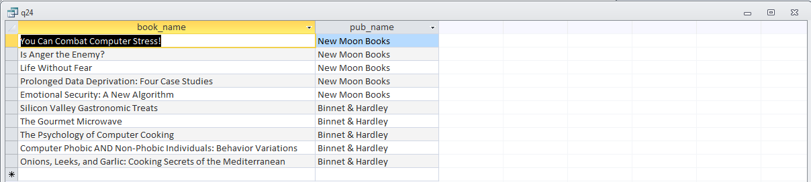

##Описание базы данных

Для выполнения заданий используется база данных книготорговой компании pubs, которая включает три таблицы, определяющие сущности: 
таблица authors определяет авторов, таблица publishers – издателей, titles – сами книги, titleauthor – задает отношение между 
таблицами titles и authors. Связь между таблицами titles и publishers определяется столбцом pub_id в этих таблицах. Ниже приводится 
описание полей таблиц.

**Таблица authors**:
- au_id: идентификатор автора
- au_lname:	фамилия автора
- au_fname:	имя автора
- phone: номер телефона
- address: адрес(улица, дом, квартира)
- city:	город проживания
- state: штат проживания
- zip: код
- contract:	наличие контракта

Таблица publishers:
- pub_id:	идентификатор издательства
- pub_name:	название издательства
- city:	город
- state: штат
- country: страна

Таблица titles:
- title_id:	идентификатор книги
- title: название книги
- type:	тип книги
- pub_id:	идентификатор издательства
- price: цена
- advance: стоимость предварительной продажи
- ytd_sales: число книг, проданных в текущем году
- notes: замечания
- pubdate: дата опубликования

Таблица titleauthor:
- au_id	идентификатор названия книги,
- title_id	идентификатор книги,
- au_ord	порядок автора вasdf названии книги
- royaltyper	авторский гонорар

В столбцах type таблицы titles используются следующие типы книг:
- business:	книги по бизнесу
- mod_cook:	книги по современной кулинарии
- popular_comp:	книги по компьютерной тематике
- psychology:	книги по психологии
- trad_cook: книги по традиционной кулинарии
- UNDECIDED: неопределенный тип книги

В столбце state таблиц authors и publishers используются следующие обозначения административных единиц:
- CA	Калифорния
- DC	округ Колумбия
- IL	штат Иллинойс
- IN	штат Индиана
- RS	штат Канsdfзас
- MD	штат Мэриленд
- MA	штат Массачусетс
- MI	штат Мичиган
- NY	штат Нью-Йорк
- OR	штат Орегон
- TN	штат Теннеси
- TX	штат Техас
 -UT	штат Юта

Домен городов (city) включает города: Ann Arbor, Berkeley, Boston, Chicago, Corvallis, Colevo, Dallas, Gary, Lawrence, Menlo Park, Munchen, Nashville, New York, Oaklend, Palo Alto, Paris, Rockvill, Salt Lake City, San Francisco, San Jose, Vacaville, Walnul Creek, Washington. 

##Выполненные запросы:

15)	Определить среднюю стоимость книги.
> Среднюю стоимость находим с помощью агрегирующей функции AVG.

```sql
SELECT AVG(t.price) AS avg_book_price
FROM titles AS t
```


18)	Определить число авторов, проживающих в Калифорнии.
> Выбираем все строки авторов, поле state которых = CA, и применяем агрегирующую функцию COUNT.

```sql
SELECT Count(*) AS authors_count_in_California
FROM authors
WHERE authors.state = 'CA'
```


23) Выбрать названия книг и имена выпустивших их издателей.
24)	То же, что и 23, но в предложении FROM запроса использовать операцию JOIN.
> Выбираем все имена из таблицы книг, присоединяем по pub_id таблицу publishers и выбираем имя издаетльства.

```sql
SELECT TOP 10 t.title AS book_name, pub.pub_name
FROM titles AS t
INNER JOIN publishers AS pub
ON t.pub_id = pub.pub_id
```


38)	Выбрать тип и среднюю цену книг данного типа, причем эта средняя цена должна быть меньше средней цены всех книг. В запросе использовать подзапрос, определяющий среднюю цену всех книг.
> Сначала группируем все книги по типам, затем сравниваем среднюю цену по типу и среднюю цену всех книг, группа выбирается, если ее средняя цена меньше средней цены всех книг. 

```sql
SELECT t.type AS book_type, AVG(t.price) AS avg_booktype_price
FROM titles AS t
GROUP BY t.type
HAVING AVG(t.price) < (
    SELECT AVG(t.price) AS avg_book_price
    FROM titles AS t
)
```


73)	Определить книги, стоимости которых составляют не более средней стоимости по издательству, где издавались эти книги.
> В подзапросе находим среднюю цену для издательства текущей книги, если она больше, чем цена текущей книги, то книга включается в выборку.

```sql
SELECT *
FROM titles AS t1
WHERE t1.price <= (
    SELECT AVG(t2.price) AS avg_booktype_price
    FROM titles AS t2, publishers AS pub
    GROUP BY t2.pub_id
    HAVING t1.pub_id = t2.pub_id
)
```


74)	Определить для каждого штата число находящихся в нем издательств.
> Группируем издательства по штатам и считаем количество в каждой группе.

```sql
SELECT p.state, COUNT(*) AS pub_count_in_state
FROM publishers AS p
GROUP BY p.state
HAVING p.state IS NOT NULL
```


87)	Определить для штатов число издательств, в которых выпускаются только книги ценой более 7 долларов. В запросе использовать подзапросы и предикат с квантором.
> Используем квантор ALL, подзапросом которого являются все книги текущего издательства, если все эти цены меньше 7, тогда издательство выбирается.

```sql
SELECT p.state, COUNT(*) AS pub_count_in_state
FROM publishers AS p
WHERE 7 > ALL (
        SELECT t.price
        FROM titles AS t
        WHERE t.pub_id = p.pub_id  
)
GROUP BY p.state
HAVING p.state IS NOT NULL;
```


90)	Определить издательства, не выпустившие книг.
> В запрос включаются те издательства, которые отсутствуют в подзапросе, разбивающем книги на издательства. Если нету группы книг по текущему издательству, то это значит, что оно не выпустило ни одной книги.

```sql
SELECT *
FROM publishers AS p
WHERE p.pub_id NOT IN (
    SELECT t.pub_id
    FROM titles AS t
    GROUP BY t.pub_id
)
```


