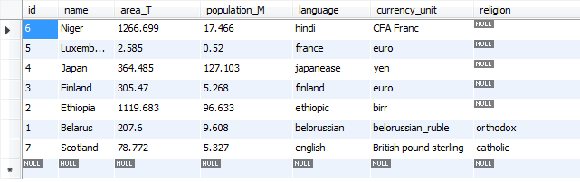

## Lab 3, variant 5

Схема таблицы ГОСУДАРСТВА:
-	Название
-	Площадь (км2)
-	Население
-	Язык
-	Денежная единица
-	Религия

**Ограничение уникальности**: название государства.<br>
**Проверочные ограничения**: <br>
    a) религия должна быть из следующего списка: римско-католическая, православная, ислам, буддизм, иудаизм, лютеранская, протестантская.<br> 
    b) площадь и население >0.<br>
**Спецификация представления**: представляемая таблица содержит название государства, площадь, население, религию для государств с 
английским языком общения.<br>
**Спецификация курсора**: результирующая таблица включает все сведения о странах с религией ислам.

## Выполнение работы

> Составить оператор создания таблицы с учетом приведенных в задании ограничений и выполнить данный оператор на SQL сервере в базе данных electr. 

```sql
CREATE TABLE `2016_studentdb`.`ta5_Vladimirskiy_countries` (
    `id` INT NOT NULL AUTO_INCREMENT,
    `name` VARCHAR(45) UNIQUE NULL,
    `area_T` DOUBLE NULL,
    `population_M` DOUBLE NULL,
    `language` VARCHAR(45) NULL,
    `currency_unit` VARCHAR(45) NULL,
    `religion` VARCHAR(45) NULL,    
    PRIMARY KEY (`id`),
    CHECK (`religion` IN ('catholic', 'orthodox', 'islam', 'buddhism', 'judaism', 'lutheran', 'protestant', NULL) AND 
        `area_T` > 0 AND 
        `population_M` > 0))
```

> Заполнить созданную таблицу с использованием оператора включения (6-8 записей). Просмотреть заполненную таблицу.

```sql
INSERT INTO `2016_studentdb`.`ta5_Vladimirskiy_countries` (`id`, `name`, `area_T`, `population_M`, `language`, `currency_unit`, `religion`) VALUES ('1', 'Belarus', '207.6', '9.608', 'belorussian', 'belorussian_ruble', 'orthodox');
INSERT INTO `2016_studentdb`.`ta5_Vladimirskiy_countries` (`id`, `name`, `area_T`, `population_M`, `language`, `currency_unit`) VALUES ('2', 'Ethiopia', '1119.683 ', '96.633', 'ethiopic', 'birr');
INSERT INTO `2016_studentdb`.`ta5_Vladimirskiy_countries` (`id`, `name`, `area_T`, `population_M`, `language`, `currency_unit`) VALUES ('3', 'Finland', '305.470 ', '5.268', 'finland', 'euro');
INSERT INTO `2016_studentdb`.`ta5_Vladimirskiy_countries` (`id`, `name`, `area_T`, `population_M`, `language`, `currency_unit`) VALUES ('4', 'Japan', '364.485 ', '127.103', 'japanease', 'yen');
INSERT INTO `2016_studentdb`.`ta5_Vladimirskiy_countries` (`id`, `name`, `area_T`, `population_M`, `language`, `currency_unit`) VALUES ('5', 'Luxembourg', '2.585', '0.520', 'france', 'euro');
INSERT INTO `2016_studentdb`.`ta5_Vladimirskiy_countries` (`id`, `name`, `area_T`, `population_M`, `language`, `currency_unit`) VALUES ('6', 'Niger', '1266.699 ', '17.466', 'hindi', 'CFA Franc');
INSERT INTO `2016_studentdb`.`ta5_Vladimirskiy_countries` (`id`, `name`, `area_T`, `population_M`, `language`, `currency_unit`, `religion`) VALUES ('7', 'Scotland', '78.772 ', '5.327', 'english', 'British pound sterling', 'catholic');
```
```sql
SELECT * FROM 2016_studentdb.ta5_Vladimirskiy_countries;
```


> Изменить одну или несколько строк таблицы с использованием поисковой модификации. Просмотреть измененную таблицу.

```sql
UPDATE `2016_studentdb`.`ta5_Vladimirskiy_countries` SET `religion`='orthodox' WHERE `id`='3';
UPDATE `2016_studentdb`.`ta5_Vladimirskiy_countries` SET `religion`='catholic' WHERE `id`='5';
```


> Удалить одну или несколько строк из таблицы с использованием оператора поискового удаления. Просмотреть измененную таблицу.

```sql
DELETE FROM `2016_studentdb`.`ta5_Vladimirskiy_countries` WHERE `id`='1';
```


### Работа с курсором
Было сделано следующее:<br>
Обявлен курсор для всех католических стран, и с помощью него выбрана первая страна в списке. Для этого создана процедура. Также создается промежуточная таблица, чтобы собрать все необходимые id из таблицы стран(имитация массива).

```sql
CREATE PROCEDURE `pr5_Vladimirskiy`()
BEGIN
	DECLARE done INT DEFAULT FALSE;
	DECLARE id INT;
	DECLARE religion VARCHAR(45);
    
	DECLARE cu5_Vladimirskiy CURSOR FOR 
	SELECT t.id FROM 2016_studentdb.ta5_Vladimirskiy_countries AS t
    WHERE t.religion = 'catholic';
    
	DECLARE CONTINUE HANDLER FOR NOT FOUND SET done = TRUE;
    
    CREATE TEMPORARY TABLE temp (c_id INT);
 
	OPEN cu5_Vladimirskiy;    
     
	cloop: LOOP    
		IF done = 1 THEN 
			LEAVE cloop;
		END IF;
 
		FETCH cu5_Vladimirskiy INTO id;
        INSERT INTO temp (c_id) VALUES (id); 
	END LOOP cloop;

	SELECT * FROM 2016_studentdb.ta5_Vladimirskiy_countries AS t 
    WHERE t.id IN(SELECT c_id FROM temp)
    LIMIT 1;
    
    DROP TEMPORARY TABLE IF EXISTS temp;

	CLOSE cu5_Vladimirskiy;
END
```
Вызов процедуры 
```sql
CALL pr5_Vladimirskiy()
```
выдает следующий результат:<br>


### Работа с представлением
> В соответствии с заданием составить оператор создания представления, выполнить данный оператор. Просмотреть представляемую таблицу.

```sql
CREATE VIEW 2016_studentdb.vi5_Vladimirskiy 
AS SELECT t.name, t.area_T, t.population_M, t.religion 
FROM 2016_studentdb.ta5_Vladimirskiy_countries AS t
WHERE t.language = 'english';
```


> Включить несколько записей в представляемую таблицу с использованием оператора включения. Просмотреть представляемую и базовую таблицы и сравнить их с предыдущими вариантами этих таблиц.

```sql
INSERT INTO 2016_studentdb.vi5_Vladimirskiy 
(name, area_T, population_M, religion ) 
VALUES ('England', 150, 15, 'catholic');
```


> Удалить несколько строк из представляемой таблицы с использованием оператора поискового удаления. Просмотреть представляемую и базовую таблицы и сравнить их с предыдущими вариантами этих таблиц.

```sql
DELETE FROM 2016_studentdb.vi5_Vladimirskiy 
WHERE name = 'England'
```


> Удалить представление с использованием оператора удаления представления.

```sql
DROP VIEW 2016_studentdb.vi5_Vladimirskiy
```

